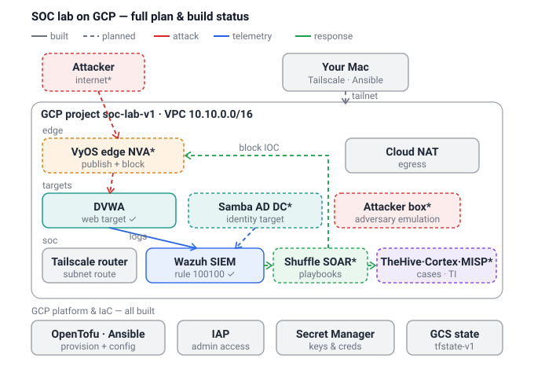

# SOC Lab — Architecture

A Linux/open-source SOC pipeline on GCP, provisioned with OpenTofu + Ansible and
run ephemerally (spin up / tear down on demand). This is a learning replica of a
documented Azure hybrid SOC, re-platformed to GCP with OSS substitutes.

**Legend:** solid = built & verified · dashed = planned · red = attack ·
blue = telemetry · green = response.

## Network

One VPC (`10.10.0.0/16`) split into three subnets:

| Subnet | CIDR | Holds |
|---|---|---|
| `edge` | 10.10.30.0/24 | VyOS edge NVA*, Cloud NAT |
| `targets` | 10.10.20.0/24 | DVWA, Samba AD DC*, attacker box* |
| `soc` | 10.10.10.0/24 | Tailscale router, Wazuh, Shuffle*, TheHive/Cortex/MISP* |

All VMs are private (no public IPs). Admin access is bastion-less over a
Tailscale subnet router; egress is via Cloud NAT.

## Build status

**Built (Increments 0–6)**

- Access & egress — Tailscale subnet router, Cloud NAT, IAP fallback
- SIEM — Wazuh (all-in-one), with custom web-attack rule `100100` (MITRE T1190)
- Target & telemetry — DVWA shipping apache logs into Wazuh via the Wazuh agent
- Platform/IaC — OpenTofu + Ansible, Secret Manager, GCS remote state (`soc-lab-tfstate-v1`)

**Planned**

- Response half — VyOS edge (publish + block) and Shuffle SOAR (Wazuh → block IOC + open case)
- Case management / threat intel — TheHive · Cortex · MISP
- More attack surface — Samba AD DC (identity attacks) and a dedicated attacker box

## Open decision

The response half has two candidate designs:

1. **Faithful VyOS edge** — publish DVWA on VyOS's public IP (firewall-locked to a
   `/32`), preserve the real attacker IP, and block at the perimeter via VyOS API.
2. **Wazuh Active Response** — no public exposure; the manager triggers a host-level
   `iptables` drop the moment a rule fires.

_\* planned / not yet built_
